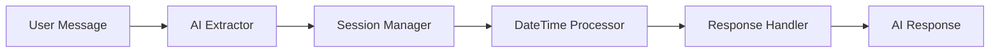

# AI-Powered Modular Train Booking Agent

A sophisticated train booking assistant that uses artificial intelligence for natural language processing instead of traditional regex pattern matching. The system features a modular architecture with clean separation of concerns and advanced AI capabilities.

## 🚀 Key Features

### AI-Powered Natural Language Processing
- **No Regex Patterns**: Uses Google Gemini AI for intelligent text understanding
- **Complex Expression Parsing**: Handles expressions like "next Tuesday morning" or "day after tomorrow evening"
- **Contextual Understanding**: Maintains conversation context for better information extraction
- **Multi-turn Conversations**: Intelligently manages complex booking workflows

### Modular Architecture
- **Clean Separation**: Each module has a specific responsibility
- **Easy Testing**: Individual components can be tested in isolation
- **Scalable Design**: Easy to add new features or modify existing ones
- **Maintainable Code**: Clear interfaces between components

### Advanced Date/Time Processing
- **Relative Dates**: "tomorrow", "next Monday", "day after tomorrow"
- **Complex Expressions**: "sometime next week", "early next month"
- **Flexible Parsing**: "after 8 AM", "before evening"
- **Context Awareness**: Considers conversation history for disambiguation

## 📁 Project Structure

```
testing_python/
├── services/
│   ├── ai_extractor.py          # AI-powered information extraction
│   ├── session_manager.py       # Session and conversation management
│   ├── train_search.py          # Train search and booking logic
│   ├── response_handler.py      # AI response generation
│   ├── datetime_processor.py    # Advanced date/time parsing
│   ├── ai_agent_modular.py      # Main modular agent orchestrator
│   ├── ai_agent_simple.py       # Original simple agent (legacy)
│   ├── ai_agent.py             # Original complex agent (legacy)
│   ├── railradar_api.py        # Railway data API integration
│   └── irctc_automation.py     # IRCTC booking automation
├── templates/
│   └── index.html              # Web interface
├── static/                     # Static web assets
├── main.py                     # Flask web application
├── demo_ai_agent.py           # Comprehensive demonstration script
├── requirements.txt           # Python dependencies
└── README.md                  # This documentation
```

## 🧩 Module Descriptions

### 1. AIInformationExtractor (`ai_extractor.py`)
**Purpose**: Extract travel information from natural language using AI

**Key Features**:
- AI-powered entity extraction (cities, dates, times, preferences)
- City name standardization with variation handling
- Confidence scoring for extracted information
- Intelligent merging of information across conversation turns

**Example**:
```python
extractor = AIInformationExtractor()
travel_info = extractor.extract_travel_information(
    "I need to go from Mumbai to Bangalore tomorrow morning for 2 people"
)
# Returns: TravelInfo object with structured data
```

### 2. SessionManager (`session_manager.py`)
**Purpose**: Manage user sessions and conversation state

**Key Features**:
- Session lifecycle management
- Conversation history tracking
- Travel information persistence
- Context data management for AI processing

**Example**:
```python
session_manager = SessionManager()
session = session_manager.get_or_create_session("user_123")
session_manager.add_conversation_message("user_123", "user", "Book train to Delhi")
```

### 3. TrainSearchService (`train_search.py`)
**Purpose**: Handle train searches and route planning

**Key Features**:
- Railway station lookup and standardization
- Train search with filters and preferences
- Time-based filtering (morning, evening, etc.)
- Result formatting and presentation

**Example**:
```python
search_service = TrainSearchService()
results = search_service.search_trains(travel_info, filters)
formatted_results = search_service.format_train_results(results)
```

### 4. AIResponseHandler (`response_handler.py`)
**Purpose**: Generate contextual responses using AI

**Key Features**:
- Context-aware response generation
- Conversation flow management
- Train selection detection
- Error handling with helpful suggestions

**Example**:
```python
response_handler = AIResponseHandler()
response = response_handler.generate_response(
    user_message, session_state, context_data
)
```

### 5. DateTimeProcessor (`datetime_processor.py`)
**Purpose**: Advanced date and time parsing with AI

**Key Features**:
- Complex natural language date parsing
- Relative date resolution ("next Monday", "day after tomorrow")
- Time preference extraction and standardization
- Alternative date suggestions

**Example**:
```python
datetime_processor = DateTimeProcessor()
result = datetime_processor.parse_datetime_expression("next Tuesday morning")
# Returns: {'travel_date': '2024-01-16', 'time_preference': 'morning'}
```

### 6. ModularTrainBookingAgent (`ai_agent_modular.py`)
**Purpose**: Main orchestrator that coordinates all modules

**Key Features**:
- Coordinates all modular components
- Manages conversation flow
- Provides unified API for external systems
- System health monitoring

## 🔄 How It Works

### 1. User Input Processing


### 2. Information Extraction Flow
1. **User Input**: Natural language message
2. **AI Extraction**: Gemini AI extracts structured information
3. **Context Merging**: New info merged with existing session data
4. **Validation**: Information validated and enhanced
5. **Response Generation**: Contextual response created

### 3. Train Search Process
1. **Information Check**: Verify all required data is available
2. **Station Lookup**: Find railway stations for cities
3. **Search Execution**: Query railway API with filters
4. **Result Processing**: Format and filter results
5. **Presentation**: Generate user-friendly response

## 🆚 Comparison: Old vs New Approach

### Old Approach (Regex-based)
```python
# Limited pattern matching
if 'mumbai' in message.lower():
    source_city = 'Mumbai'

# Simple date patterns
if 'tomorrow' in message.lower():
    travel_date = 'tomorrow'

# Basic number extraction
numbers = re.findall(r'\d+', message)
```

### New Approach (AI-powered)
```python
# Intelligent extraction with context
travel_info = ai_extractor.extract_travel_information(
    user_message, conversation_context
)

# Advanced date parsing
datetime_result = datetime_processor.parse_datetime_expression(
    "next Tuesday morning", context
)

# Contextual response generation
response = response_handler.generate_response(
    user_message, session_state, additional_context
)
```

## 🎯 Benefits of Modular Architecture

### 1. **Maintainability**
- Each module has a single responsibility
- Clear interfaces between components
- Easy to modify or replace individual modules

### 2. **Testability**
- Components can be tested in isolation
- Mock dependencies for unit testing
- Better code coverage and reliability

### 3. **Scalability**
- Easy to add new features
- Components can be optimized independently
- Horizontal scaling possibilities

### 4. **Flexibility**
- Different AI models can be plugged in
- Multiple conversation flows supported
- Easy integration with external systems

## 🚀 Getting Started

### Prerequisites
- Python 3.8+
- Google Gemini API key
- Required Python packages (see requirements.txt)

### Installation
```bash
# Clone the repository
git clone <repository-url>
cd testing_python

# Install dependencies
pip install -r requirements.txt

# Set up environment variables
cp .env.example .env
# Edit .env with your API keys
```

### Configuration
```bash
# .env file
GEMINI_API_KEY=your_gemini_api_key_here
FLASK_SECRET_KEY=your_flask_secret_key
```

### Running the Application

#### Web Interface
```bash
python main.py
# Open http://localhost:5000 in your browser
```

#### Demonstration Script
```bash
python demo_ai_agent.py
```

## 📊 API Endpoints

### Core Chat Endpoint
```http
POST /chat
Content-Type: application/json

{
  "message": "I want to book a train from Delhi to Mumbai tomorrow morning"
}
```

### Enhanced Endpoints
```http
GET /session_summary          # Get AI-extracted session information
GET /conversation_history     # Get conversation history
GET /alternatives            # Get AI-suggested alternatives
POST /reset_session          # Reset current session
GET /system_status          # Get system health and capabilities
```

## 🧪 Testing

### Running the Demo
```bash
python demo_ai_agent.py
```

The demonstration script showcases:
- Natural language processing capabilities
- Advanced date/time parsing
- Information extraction comparison (old vs new)
- Session management features
- Modular architecture benefits

### Example Test Cases
```python
test_cases = [
    "I want to book a train from Delhi to Mumbai tomorrow morning",
    "Emergency travel to Kolkata today for 2 passengers", 
    "Looking for trains from Pune to Goa sometime next week",
    "3 AC tickets from Chennai to Bangalore early next Monday"
]
```

## 🔮 Future Enhancements

### Planned Features
- **Multi-language Support**: Handle Hindi, regional languages
- **Voice Integration**: Speech-to-text and text-to-speech
- **Personalization**: Learn user preferences over time
- **Advanced Filters**: Price ranges, train types, amenities
- **Group Bookings**: Handle complex multi-passenger scenarios

### Technical Improvements
- **Caching Layer**: Redis for session and search result caching
- **Database Integration**: PostgreSQL for persistent storage
- **API Rate Limiting**: Intelligent request throttling
- **Monitoring**: Comprehensive logging and metrics
- **Security**: Enhanced authentication and authorization

## 🤝 Contributing

1. Fork the repository
2. Create a feature branch (`git checkout -b feature/amazing-feature`)
3. Commit your changes (`git commit -m 'Add amazing feature'`)
4. Push to the branch (`git push origin feature/amazing-feature`)
5. Open a Pull Request

## 📄 License

This project is licensed under the MIT License - see the [LICENSE](LICENSE) file for details.

## 🙏 Acknowledgments

- Google Gemini AI for natural language processing
- Railway data providers
- Open source community for various libraries used

---

**Built with ❤️ using AI-powered modular architecture**
